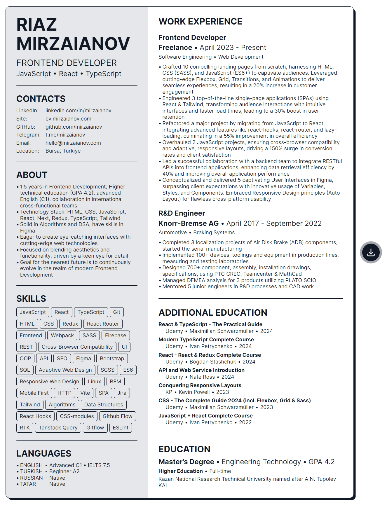

# RESUME • RIAZ MIRZAIANOV

## Description

### A personal CV Website of Riaz Mirzaianov - a Frontend Developer

Hi!

I am looking forward to hearing from you regarding any type of collaboration!

### Features

- Compelling UI & Solid UX
- Major browser compatibility
- 2 Adaptive layouts
- 7 sections
- Animated Links & Badges
- Option to download a PDF version of the site

### Dependencies

- `Vite`
- `React`

## Installation & Execution

### Install via Vite:

    git clone https://github.com/mirzaianov/cv-mirzaianov-com.git
    cd cv-mirzaianov-com
    npm install

### Run in Development mode:

    npm run dev

Vite will start frontend server on http://localhost:5173/

## Building and Running for Production

    npm run build
    npm run preview

Vite will start frontend server on http://localhost:4173/

## Licence

### MIT license

You can use the code, but I ask you do not copy this site without giving me credit.

## Version History

- 1.9.0 Release
